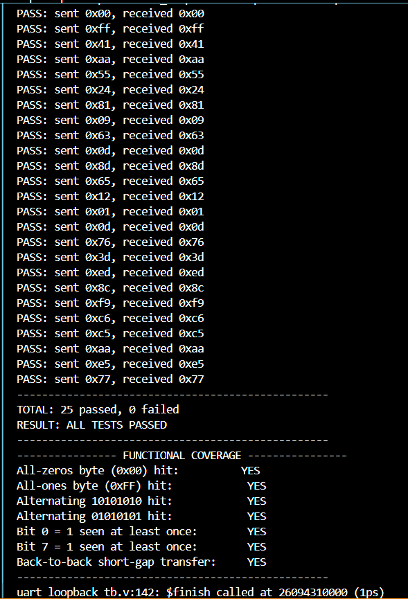
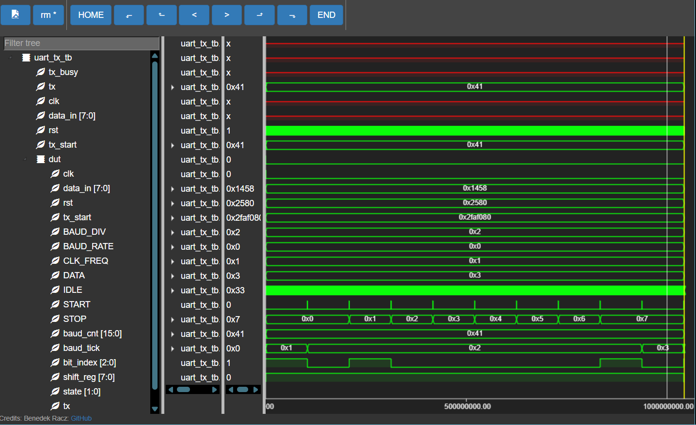
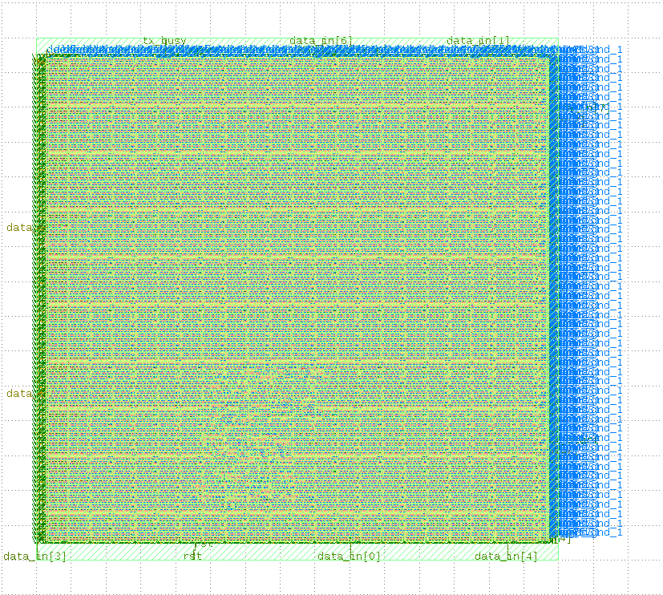
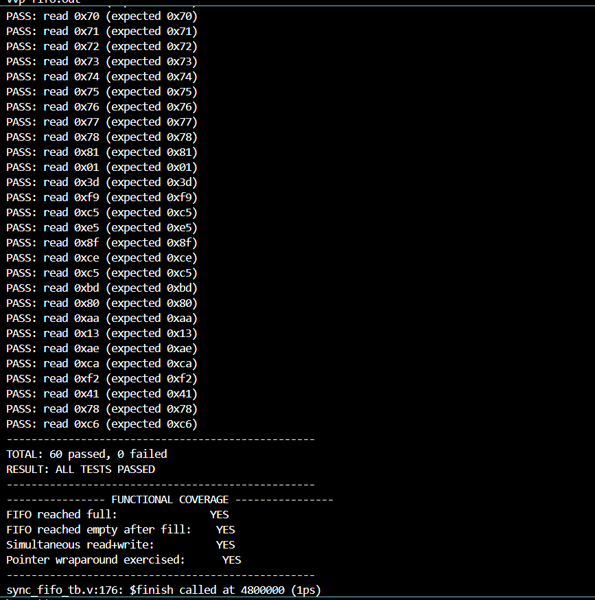
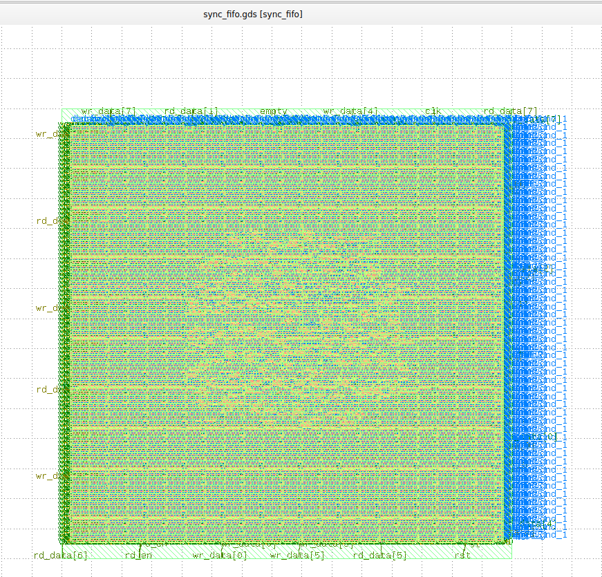

# Verilog Digital Design Portfolio

Two complete RTL-to-GDSII projects demonstrating digital design, functional verification, and physical design using open-source EDA tools (Icarus Verilog, Yosys, OpenLane, SKY130 PDK, KLayout).

---

# Project 1: UART Transmitter/Receiver — Digital ASIC Flow

A complete digital ASIC design flow for a UART TX/RX pair, built from RTL through to a manufacturable chip layout, with full loopback verification.

## What is a UART?

A UART (Universal Asynchronous Receiver/Transmitter) sends data one bit at a time over a single wire. Each byte is wrapped in a start bit, 8 data bits, and a stop bit, so the receiver can tell where each byte begins and ends without needing a shared clock signal.

## Design

- `uart_tx.v` — the transmitter: a baud rate generator (clock divider) plus a finite state machine (IDLE → START → DATA → STOP) that shifts out one byte at a time.
- `uart_rx.v` — the receiver: mirrors the TX timing but samples each bit at its midpoint (not the edge) to reliably detect real data versus line glitches.
- `uart_tx_tb.v` — standalone TX testbench, dumps a waveform for manual inspection.
- `uart_loopback_tb.v` — self-checking testbench: TX output wired directly into RX input, with an automatic pass/fail scoreboard.

Clock: 50 MHz | Baud rate: 9600

## Flow

1. **RTL** — written in Verilog, modeling the FSM and shift register logic for both TX and RX.
2. **Simulation** — compiled and run with Icarus Verilog (`iverilog` + `vvp`).
3. **Synthesis** — converted to a gate-level netlist using Yosys (151 cells for `uart_tx`).
4. **Physical Design** — floorplanning, placement, clock tree synthesis, and routing performed using OpenLane, producing a GDSII layout. Zero setup/hold timing violations.
5. **Layout Inspection** — final GDS reviewed visually in KLayout.

## Verification

**Result:** 25/25 tests passed (5 directed + 20 randomized), 7/7 functional coverage points hit (100%)

### UART Verification Plan

**Objective:** Verify that `uart_tx` and `uart_rx` correctly interoperate as a complete asynchronous serial link — any byte transmitted must be received correctly and identically.

**Strategy:** A self-checking testbench (`uart_loopback_tb.v`) drives the transmitter, waits for the receiver to capture a byte, and automatically compares sent vs. received values.

**Directed tests (edge cases):**
| Byte | Why it matters |
|---|---|
| `0x00` | All-zero data — stresses the "no toggling" case |
| `0xFF` | All-one data — opposite extreme |
| `0x41` | Real ASCII character, typical use |
| `0xAA` (10101010) | Maximum toggling — worst case for sampling-timing bugs |
| `0x55` (01010101) | Same, inverted phase |

**Randomized tests:** 20 pseudo-random bytes via `$random`.

**Timing stress test:** one transmission sent with a much shorter inter-byte gap, confirming the receiver FSM resets cleanly and is ready for the next byte quickly.

**Functional coverage:**
| Coverage point | Purpose |
|---|---|
| All-zeros byte hit | Confirms no false start-bit detection |
| All-ones byte hit | Confirms line stays idle-high correctly |
| Alternating 10101010 hit | Confirms sampling point is correctly centered |
| Alternating 01010101 hit | Same, opposite phase |
| Bit 0 = 1 observed | Confirms LSB path works |
| Bit 7 = 1 observed | Confirms MSB path works |
| Back-to-back short-gap transfer | Confirms receiver FSM resets cleanly between bytes |

**What this does *not* cover (honest scope statement):** Framing/parity error injection is not tested — this testbench assumes an ideal channel with no corrupted start/stop bits. Multiple baud rates are not swept; verification is at the fixed 9600 baud / 50 MHz configuration only.

## Screenshots

### Simulation Waveform

### Chip Layout (KLayout)

## Synthesis Report (uart_tx)

Number of wires:                112
Number of wire bits:            162
Number of public wires:          11
Number of public wire bits:      43
Number of ports:                  6
Number of port bits:             13
Number of memories:               0
Number of memory bits:            0
Number of processes:              0
Number of cells:                151
$ANDNOT                      39
$AND                          1
$DFFE_PP0P                    6
$DFFE_PP1P                    1
$DFFE_PP                      8
$DFF_PP0                     17
$MUX                         10
$NAND                        14
$NOR                          5
$NOT                          3
$ORNOT                       11
$OR                          18
$XNOR                         4
$XOR                         14

---

# Project 2: Synchronous FIFO — Physical Design Deep Dive

An 8-bit wide, 16-deep synchronous FIFO, taken through the full RTL-to-GDSII flow, with a focus on documenting real physical design analysis and debugging — not just a clean pass/fail result.

## Design

- `sync_fifo.v` — synchronous FIFO with the standard extra-bit pointer trick to distinguish full from empty without ambiguity.
- `sync_fifo_tb.v` — self-checking testbench with a reference-model scoreboard, covering fill-to-full, drain-to-empty, simultaneous read+write, pointer wraparound, and randomized mixed traffic.

**Verification result:** 60/60 tests passed, 4/4 functional coverage points hit (100%)

## Floorplan Configuration

| Setting | Value | Reasoning |
|---|---|---|
| Die area | 300 x 300 µm | Fixed absolute size, generous enough for a small design |
| Core utilization target | 35% | Low utilization leaves routing headroom, reducing congestion/DRC risk on a first-pass run |
| Placement density target | 0.4 | Kept below utilization target, giving the detailed placer room to legalize cells |
| Clock period | 20 ns (50 MHz) | Well above what this small design needs — timing closure was not the limiting factor |

Actual floorplanned die size after the run: **288.88 x 277.44 µm**.

## Timing (STA) Results

- **Setup violations: 0**
- **Hold violations: 0**
- Sample paths from the signoff STA report show 13-16 ns of positive slack margin on a 20 ns clock period.

## DRC / LVS / XOR Signoff

- **DRC violations after detailed routing: 0**
- **DRC violations after GDS streamout: 0**
- **LVS: passed**
- **XOR check (Magic GDS vs. KLayout GDS): 0 differences**

## Debugging Investigation: Max Fanout Warning

The signoff STA report flagged a non-fatal warning: `max fanout violation count: 3`. Three clock-tree buffer nets exceeded the default max-fanout limit of 10, driving between 11-16 downstream flip-flop clock pins each.

**Investigation:** these are clock-tree buffers inserted automatically during Clock Tree Synthesis (CTS), not user RTL signals. CTS built a shallow tree appropriate for this design's small flip-flop count (16 registers total), and a few buffers ended up modestly over the general-purpose fanout guideline.

**First fix attempt:** tightened `SYNTH_MAX_FANOUT` from the default (10) to 6 and re-ran the flow. This made the reported violation count *worse* (3 → 16), because `SYNTH_MAX_FANOUT` constrains fanout during logic synthesis, not the clock-tree buffering inserted later by CTS — it was the wrong parameter for this issue. Reverted the change.

**Conclusion:** despite the design-rule violation count, the underlying timing was never actually broken in either run — every path reported `slack (MET)` with large positive margin, and both setup/hold checks passed cleanly. This is a concrete illustration of the difference between a **design-rule-style violation** (a conservative signal-integrity guideline) and an **actual timing failure** (a path that would not meet the clock frequency) — the former does not automatically imply the latter. A correct fix would involve tuning CTS-specific buffering parameters rather than synthesis-level ones, left as a documented follow-up since the design already meets all functional timing requirements.

## Layout

---

## What I Learned

- How UART protocol timing works and how to implement it as an FSM in Verilog, both transmit and receive sides.
- How to build a self-checking verification environment with directed tests, randomized tests, and functional coverage tracking.
- The full RTL-to-GDSII flow: simulation, synthesis, floorplanning, placement, CTS, routing, and signoff (DRC/LVS/STA).
- The practical difference between a design-rule violation and an actual timing failure, and how to investigate a physical design warning rather than either ignoring it or blindly "fixing" it without understanding the root cause.
- Troubleshooting a real open-source toolchain (WSL, Docker, OpenLane, GTKWave) from scratch.